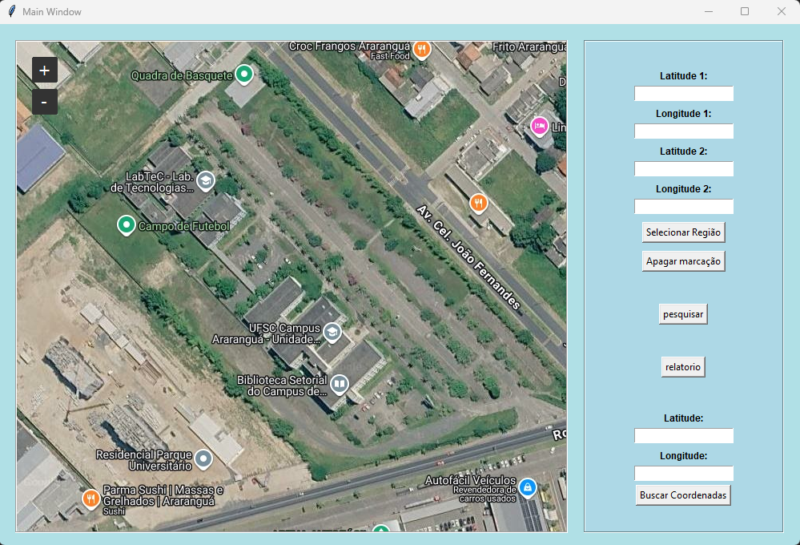
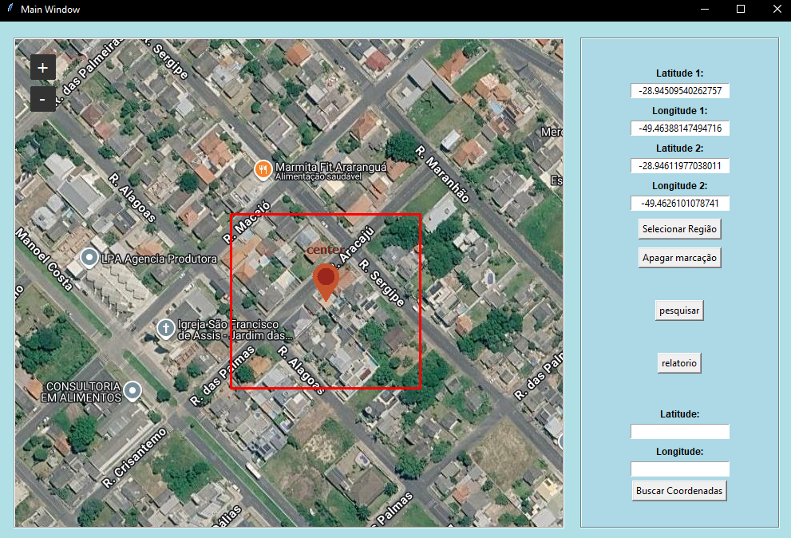
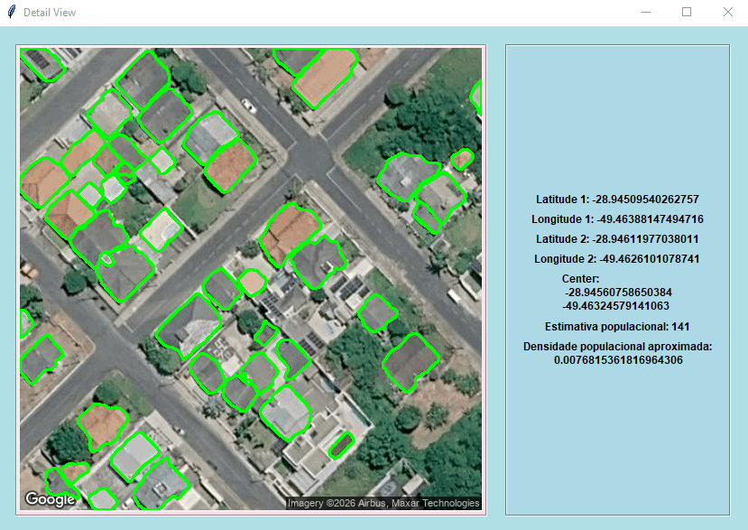
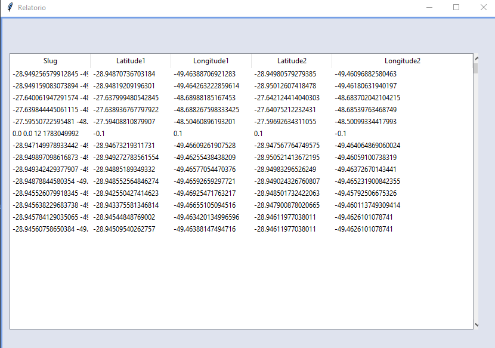

# 📚 Tutorial de Uso: Censo Demográfico via Satélite

Bem-vindo ao guia passo a passo do sistema! Aqui você aprenderá como utilizar a interface gráfica para delimitar áreas no mapa, realizar a contagem automatizada de construções e visualizar os relatórios de densidade populacional.

---

## 1. Tela Inicial

Ao executar o aplicativo, a janela principal será aberta. Ela é dividida em duas partes: o visualizador interativo do mapa do Google à esquerda e o painel de controle com as ferramentas de seleção e pesquisa à direita.

 

## 2. Selecionando a Região de Interesse

Para que a seja feito a estimativa, você precisa primeiro definir um perímetro no mapa. Existem **duas formas** de fazer isso:

* **📍 Pelo Mapa (Usando o mouse):** Navegue pelo mapa e clique com o **botão direito do mouse** para marcar o primeiro ponto (um dos cantos do retângulo). Em seguida, clique novamente com o botão direito em um ponto oposto para fechar a área desejada.
* **⌨️ Por Input Manual (Coordenadas):** Se você já possui as coordenadas exatas da região, digite os valores numéricos nos campos `Latitude 1`, `Longitude 1`, `Latitude 2` e `Longitude 2` localizados no painel direito. Após preencher, clique no botão **"Selecionar Região"**.

Após a seleção, um retângulo vermelho aparecerá no mapa, delimitando com precisão a área que será analisada:

> **Dica:** Caso queira refazer a demarcação, basta clicar no botão **"Apagar marcação"** para limpar o mapa e as coordenadas da tela.

 

## 3. Gerando a Estimativa Populacional

Com a sua região devidamente marcada (retângulo vermelho), clique no botão **"pesquisar"**. 

O sistema fará o recorte do mapa e enviará a imagem para o nosso modelo de visão computacional. Uma nova janela será aberta detalhando os resultados da inferência: você verá as construções identificadas (contornadas em verde), as coordenadas centrais, a estimativa populacional total e a densidade daquela área.

 

## 4. Acessando o Relatório e Histórico

O programa salva um histórico das análises realizadas no banco de dados para facilitar o controle. Caso queira consultar as regiões que já foram processadas no passado, retorne à janela principal e clique no botão **"relatorio"**.

Uma tabela será exibida contendo os registros estruturados de todas as suas buscas anteriores:

---

**Pronto!** 🎉 Agora você já sabe como operar o sistema de ponta a ponta.